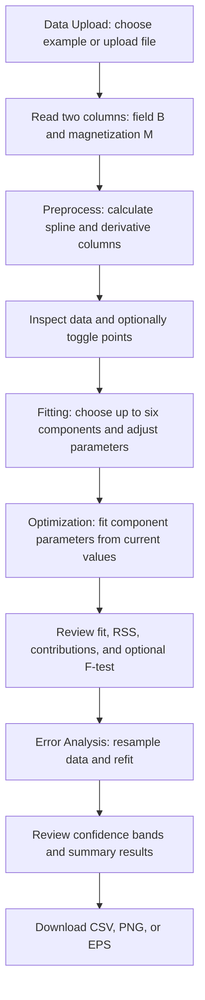

# MAX UnMix Processing Flow

## Purpose and Scope

This document describes how the application is organized and how data moves through it. The descriptions are based on `ui.R` and `server.R`; they explain the current implementation, not an independent validation of the scientific method.

The application uses Shiny's `input` values to drive server-side reactive calculations. `ui.R` defines controls and output locations. `server.R` reads the inputs, calculates derived data and models, and sends plots, tables, and downloads to those output locations.

## Application Flow

The tabs are defined in `ui.R`: **Data Upload**, **Fitting**, **Optimization**, **Error Analysis**, **Resources**, and **Updates**. Resources and Updates provide information and do not participate in the main calculation path.

## Data Upload and Preprocessing

The first tab accepts either the bundled example file (`PCB-01-TRB-050.txt`) or an uploaded file. The uploaded file is read using the selected header and separator options. When the file has no header, the first two columns are named `B` (field) and `M` (magnetization). The example file is read as whitespace-separated data and assigned the same names.

If the first field value is zero, the code replaces it with the mean of the first and second field values. It then appends derived columns to the data frame:

| Column | Meaning in the current implementation |
| --- | --- |
| `B`, `M` | Original field and magnetization values (columns 1 and 2). |
| `V3` | Base-10 logarithm of field, `log10(B)`. |
| `V4` | Spline-smoothed magnetization against `log10(B)`, using the selected smoothing factor. |
| `V5` | Absolute first derivative of the smoothed magnetization against `log10(B)`. |
| `V6` | Spline-smoothed magnetization against `B`, using the selected smoothing factor. |
| `V7` | Absolute first derivative of the smoothed magnetization against `B`. |
| `V8` | Absolute first derivative against `log10(B)` from a spline with `spar = 0`. |
| `V9` | Absolute first derivative against `B` from a spline with `spar = 0`. |
| `V10` | Smoothed version of `V8`, against `log10(B)`, using the selected smoothing factor. |
| `V11` | Smoothed version of `V9`, against `B`, using the selected smoothing factor. |

The smoothing factor and smoothing options affect the curves used for display and fitting. The first tab can display magnetization or its derived coercivity spectrum, on linear or logarithmic field axes. Clicking a point or brushing a region toggles those rows between included and excluded; Reset restores all rows. The table and first plot are rendered as `contents` and `plot1`.

## Fitting

The Fitting tab offers up to six components. Each enabled component has parameters for mean coercivity (`B`), dispersion (`DP`), relative proportion (`P`), and, when skewness is enabled, skewness (`S`). Component parameter panels are generated in the server and shown only for enabled components. A component's values can be saved and restored within the session.

The `plot2` output draws the selected data spectrum, the chosen smoothed target curve, each component curve, and their sum. Component curves use either a normal density (`dnorm`) or a skew-normal density (`dsnorm`, from `fGarch`), depending on the skewness option. The density is normalized to its maximum and scaled by the target curve's maximum and the component's `P` value. The displayed residual sum of squares (RSS) is the sum of squared differences between the combined component curve and the selected target curve.

This stage is for manually adjusting starting values. The common-components table is reference information and is not used to calculate the fit.

## Optimization

The Optimization tab starts from the enabled components and parameter values chosen on the Fitting tab. The server constructs a field grid and target curve, then calls R's `optim()` to minimize the sum of squared differences between the target and the summed component curves. The number of enabled components and the skewness option determine the parameter layout and density function.

The optimized fit is shown in `plot3`. The tab also shows the optimized parameters and RSS. It can compare the current fit with a previously entered RSS using an F-test option. The code calculates component area contributions over the measured field range and over a wider extrapolated field range; these are reported in the result output as `OC`/`TC` and `EC` values.

The sliders set ranges for interactive starting values. The optimizer is called without explicit lower or upper bounds, so those slider ranges should not be assumed to constrain the optimized values.

## Error Analysis

Clicking **START** is intended to run the resampling analysis. The controls specify the number of resamples and the proportion of data points used for each resample. For each sample, the code derives a spline or derivative curve, interpolates it onto a common field grid, and fits the selected component model from perturbed starting parameters.

The resampled curves and component fits are summarized using means and 2.5th/97.5th percentiles. These summaries are used to draw uncertainty bands and calculate mean and uncertainty estimates for component parameters and area contributions. The results are displayed in `plot4` and the results outputs. Downloads are provided for CSV results and PNG/EPS plots; logarithmic-scale results also have a normal-unit representation. A separate CSV download stores the component count and the starting parameter values that were passed to the optimizer, one row per enabled component. The export includes the field scale and whether skewness was included; skewness is blank when it was disabled.

## Main UI-to-Server Mapping

| UI control or output | Server-side role |
| --- | --- |
| `example.data`, `file1`, `header`, `sep` | Select and read the source data. |
| `scale`, `plot.type`, smoothing controls | Select the displayed and derived curves. |
| `plot1_click`, `plot1_brush`, `exclude_toggle`, `exclude_reset` | Toggle included data rows. |
| `comp1` to `comp6`, `B1`/`DP1`/`P1`/`S1` to component 6 | Choose components and their starting parameters. |
| `plot2`, `RSS.plot2` | Display the manually assembled model and its RSS. |
| `plot3`, `results`, `RSS.plot3`, `f.val`, `p.val` | Display optimized results and optional model comparison. |
| `calc.error`, `n.resample`, `p.r` | Start and configure resampling. |
| `plot4`, `final.results`, `extra.results` | Display uncertainty plots and tabular summaries. |
| `export.data`, `export.extra.data`, `export.initial.parameters`, `export.png`, `export.eps` | Download analysis outputs and the optimizer's starting parameter values. |

## Implementation Notes

- `dat` is a reactive data object. Changes to relevant upload or preprocessing inputs cause the data and dependent outputs to be recalculated.
- Point inclusion is stored separately in `vals$keeprows`; the source data is not physically deleted when points are toggled off.
- The error-analysis observer and plot rendering are nested within other reactive output code in `server.R`, and `plot4` is assigned in more than one place. This structure is unusual for Shiny and should be checked interactively before relying on the error-analysis workflow or modifying it.
- This document describes source-level behavior. The R files parse successfully with R 4.6.1, but the Shiny application has not been launched as part of writing this document.
